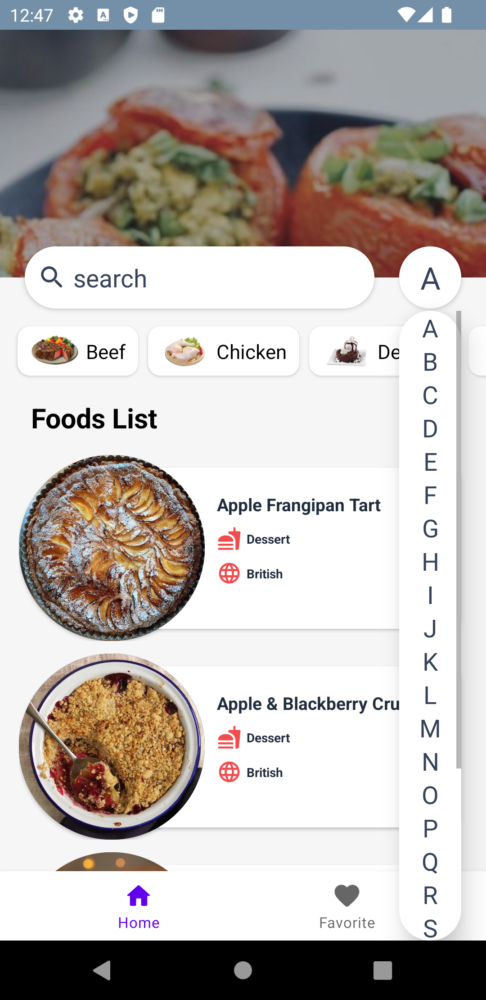
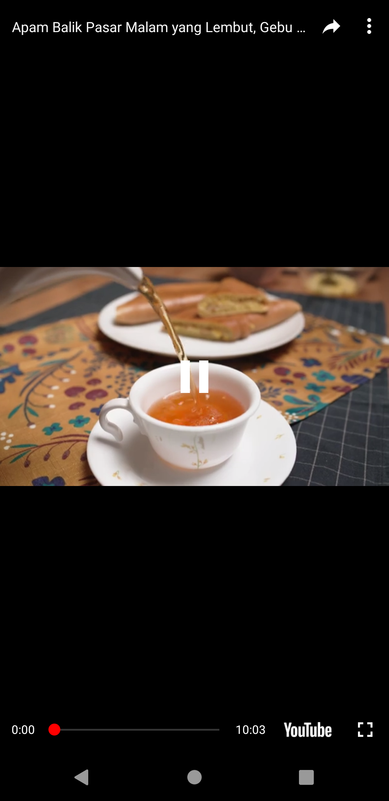
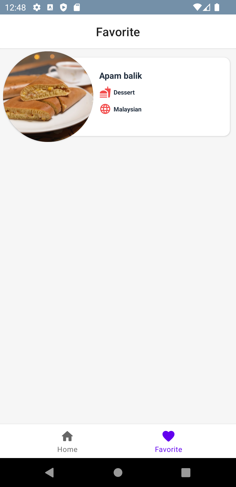

# TheMealdb-API-MVP

Overview :

The purpose of this project series is to show different architectures with different structures, and you can check these architectures and structures.

This project in

- MVP architecture : Current Repo
- MVVM architecture : https://github.com/ezatpanah/MVVM-TheMealdb-API [ Room Database - Dagger Hilt - Flow - Coroutine - LiveData]
- MVI architecture : Coming soon

The purpose of this application is to use TheMealDB API . TheMealDB: An open, crowd-sourced database of Recipes from around the world.

The app was written in Kotlin.

TheMealDB API: An open, crowd-sourced database of Recipes from around the world. The API’s Docs: https://themealdb.com/api.php

Technologies and Libraries Used :

- MVP
- Navigation Component
- View Binding
- Retrofit
- Dagger Hilt
- RxJava
- Room Database
- Coil
- Youtube API
- Lottie

Screen-Shot :
 

